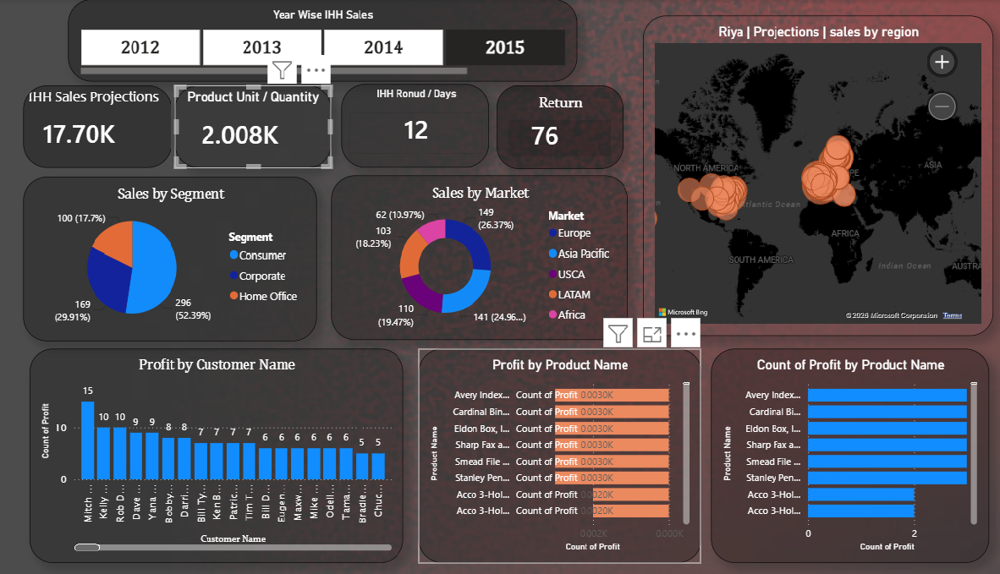

# GlobalDashboard

🌍 Global Sales Dashboard – Power BI

📌 Project Overview

The "Global Sales Dashboard" is an interactive Power BI report designed to analyze worldwide sales performance across different years, markets, customer segments, products, and regions. It provides decision-makers with a comprehensive view of key business metrics, enabling them to monitor sales trends, identify profitable markets, and make data-driven decisions using interactive visualizations and filters. Power BI supports interactive dashboards with slicers, maps, charts, and KPI cards that help users explore business data effectively. 

---

🎯 Objectives

* Monitor overall sales performance.
* Compare yearly sales trends.
* Analyze sales across global markets.
* Identify high-performing customer segments.
* Track product and customer profitability.
* Visualize regional sales distribution using an interactive map.

---

 📊 Dashboard Features

 KPI Cards

* Total Sales Projection
* Total Product Units Sold
* Average Delivery Days
* Total Returns

Interactive Filters

* Year-wise slicer (2012–2015)
* Dynamic filtering across all visuals

Visualizations

* Sales by Segment (Pie Chart)
* Sales by Market (Donut Chart)
* Regional Sales Map
* Profit by Customer (Column Chart)
* Profit by Product (Bar Chart)
* Count of Profit by Product (Horizontal Bar Chart)

---

 📈 Key Insights

* Consumer segment contributes the largest share of sales.
* Europe and Asia Pacific are among the strongest performing markets.
* Regional map highlights sales distribution across multiple continents.
* Product-level analysis helps identify the most profitable products.
* Customer profitability analysis highlights top revenue-generating customers.
* Return metrics and delivery time KPIs support operational performance tracking.

---

🛠️ Tools & Technologies

* Power BI Desktop
* Power Query (Data Cleaning & Transformation)
* DAX (Data Analysis Expressions)
* Data Modeling
* Interactive Slicers & Maps
* KPI Cards and Custom Visualizations

---

📂 Dashboard Components

* Sales Performance Overview
* Market Analysis
* Customer Analysis
* Product Analysis
* Regional Sales Visualization
* Operational KPI Monitoring

---

 🚀 Business Value

This dashboard enables stakeholders to:

* Track business performance in real time.
* Compare sales performance across years and regions.
* Identify profitable products and customers.
* Monitor returns and delivery efficiency.
* Support strategic decision-making with interactive analytics.

---

 📸 Dashboard Preview

---

 📌 Future Enhancements

* Forecast future sales using predictive analytics.
* Add drill-through pages for detailed analysis.
* Include profit margin and growth trend KPIs.
* Implement Row-Level Security (RLS).
* Connect to live data sources for real-time reporting.

---

 👨‍💻 Author

Riya
Project: Global Sales Dashboard – Power BI
Tools: Power BI, Power Query, DAX

